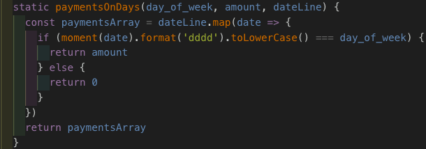
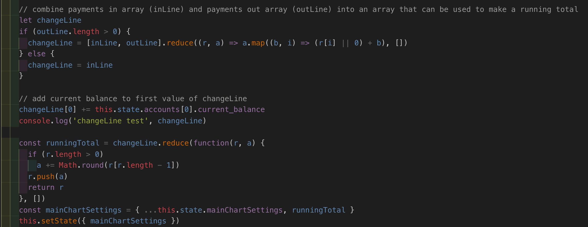

## Software Engineering Immersive at GA - Project 4: budget.lol

### Goal: To create a full-stack app with React.js and Django.

### Brief: [SEI GA Project 4 brief](p4_brief.md)

#### Timeframe: 7 days
---
### Technologies used
* React.js with Highcharts & Moment packages
* JavaScript (ES6) / HTML5 / CSS3
* Bulma CSS framework
* Django
* Python
* PostgreSQL
* Git / Github
* Heroku
* Trello

### Deployment
The app is deployed on Heroku and can be found here: [https://budget-lol.herokuapp.com/]()

### Overview
For my final project I made a forward looking budgeting tool. I wanted to create a web based version of something I used to do for myself in a spreadsheet. 

Most personal budgeting tools focus on receipt collection and trying to pin down where all your money went. My tool is designed for the user to be able to quickly load their balance, a set of transactions (which can be recurring weekly, recurring monthly or one-offs), and instantly see a projection of their balance as the chart will update in real time. Users can create, delete or edit these transactions in their dashboard and instantly see the effect of these changes. The projection can be set to look forward 1, 3, 6 or 12 months.

The project was created using React.js and Django. For speed I used the Bulma CSS framework (which ended up coming out clean and intuitive) and the charts used highcharts via highcharts-react. The most challenging elements were the use of so many forms on one dashboard, and making sure that any addition, deletion or update changes were instantly rendered correctly in the chart. 

The intention is that it is fast, easy and the effects are instantly visible.

---

### Approach
The models are:
Users => one-to-many => Accounts => one-to-many => Transactions

Users: I used the inbuilt Django User model.

Accounts: I set this up to allow multiple accounts for each user

Transactions: All transactions are essentially in the same format, whether they are money in or money out, whether they are weekly, monthly or one-offs. They all go in one table, which makes creating, editing and presenting them more straightforward.

I wanted the updating to all happen in real time, and to make sure that editing and deleting an existing transaction is possible on the page, again with the results instantly reflected in the chart.

The app is a one-page app, so everything happens in the Dashboard. Each transaction is created and then displayed in an individual, horizontal form, mapped onto the page and displayed when the category they belong to is expanded.

Whenever a transaction is created, edited or deleted, the handler that deals with this and sends the API requests to make these changes in the database also then calls a function in the dashboard component which does the following:

1. Requests updated data from the database so that changes can be reflected in the chart and the forms containing existing transactions
2. Creates the x-axis for the chart
	* 	A helper function uses the Moment and Moment-Range plugins to create an array from the current date, for the number of days passed to it by the dashboard (default 3 months, and then one month, six months and one year are selectable once the graph generates)
	*  The x-axis is an array of date strings
3. Creates a data series (in the form of an array) for every transaction belonging to the selected account
	* Each transaction has a recurrance - either weekly, monthly or one-off. If it's weekly it will have a day of week ("Monday" for example), if it's monthly it will have a date in month ("5" for example, max 28), or if it is one-off it will contain a date string for the date of payment
	* A helper function maps over the newly created x-axis array and checks to see if there is a match on the day of week, date in month or payment date, whichever is relevant. If there is no match, the function will put a 0 at that index in the array it is creating, if there is a match it will put the value of the transaction at that index in the array. So for example, assuming today is Monday and we are making a 14 day array for a weekly transaction with a payment of £65 every Tuesday, it would create an array for this transaction that looks like this: `[0, 65, 0, 0, 0, 0, 0, 0, 65, 0, 0, 0, 0, 0]`
	* An example of the helper that makes the arrays (weekly payments):

	* When these series are created, they are stored in two objects in state, one called paymentsInSeries (containing positive values), the other paymentsOutSeries (containing negative values).
4. Combines all the data series into one "running total" data series (also an array)
	* Once we have our objects containing all the payment arrays, for the main graph they need combining into one payment array
	* To achieve this the arrays are 'added together' by creating a 2D array and then reducing it to produce a single array with the the sum of all the relevant values at each index, corresponding to the correct date string in the x-axis 
	* This is done three times. Once to combine the money in, once to combine the money out, and finally to combine these two together before reducing to produce a running total. This is so that I could potential plot money in and money out separately
	* The start value of the running total is the current balance in the account
	* The part of the function that combines the payments in and payments out arrays into one running total array:
	

### Wins
* I made the choice to use Highcharts for the graph quite quickly, which meant the models and forms were set up to allow me to produce arrays in the right format for Highcharts
* Getting the live updating of the chart to work for any of the create, update or delete was satisfying
* The correct generation of the running total array was also enjoyable to work through

### Challenges

* I found it a challenge to very quickly learn Django. It felt very 'big' for this use and whilst there are some very useful things for newbies (such as user models and admin), it is difficult for a beginner to debug and set up correctly
* Scope. This was a solo project and I initially set out quite an ambitious scope. Some of what I cut is mentioned below under future changes

### Future changes & features I would like to add
* The styling was not a focus as functionality was the priority, I would spend a little more time working on this, especially the responsiveness of the dashboard and its forms and some smaller details (such as visual cues to show the user that 'update transaction' has happened successfully)
* Multiple accounts, such as savings accounts. I would aim to show the effect of saving over time from a currrent account on a savings account balance
* Easy calculations for things like take home pay, mortgage repayments and credit cards/loans
* More payment summaries by type. I have the data series already being created so would like to use them to present more information to the user
* Transaction history. This is not the current focus of the app, but would be a logical expansion